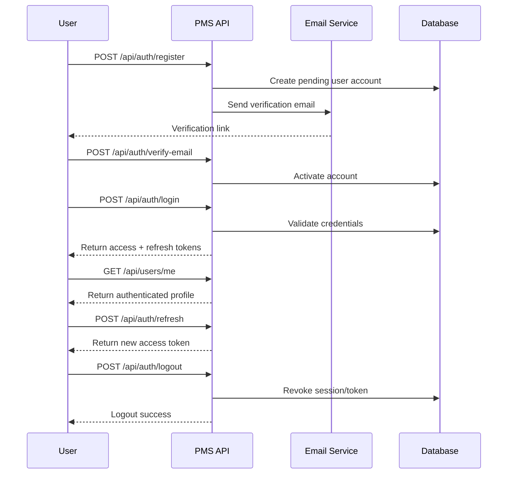

# Authentication API Design

## 1. Authentication Flow

The authentication flow for PMS should follow a standard secure pattern for modern SaaS applications.

### Flow summary
1. User registers an account.
2. The system sends an email verification request.
3. The user verifies their email.
4. The user logs in with email and password.
5. The system returns an access token and refresh token.
6. The access token is used for authenticated API requests.
7. The refresh token is used to obtain a new access token.
8. The user logs out to invalidate the active session.

## 2. Registration

### POST /api/auth/register
Request body:
- `email`
- `username`
- `full_name`
- `password`

Expected outcome:
- User account is created
- Verification email is sent
- Account remains pending until verified

## 3. Email Verification

### POST /api/auth/verify-email
Request body:
- `token`

Expected outcome:
- Email verification is completed
- User account becomes active

## 4. Login

### POST /api/auth/login
Request body:
- `email`
- `password`

Expected outcome:
- Access token returned
- Refresh token returned
- Session state created

## 5. Token Refresh

### POST /api/auth/refresh
Request body:
- `refresh_token`

Expected outcome:
- New access token returned
- Existing refresh token may be rotated

## 6. Logout

### POST /api/auth/logout
Headers:
- Authorization: Bearer {access_token}

Expected outcome:
- Current session is invalidated
- Refresh token is revoked where applicable

## 7. Password Recovery

### POST /api/auth/forgot-password
Request body:
- `email`

### POST /api/auth/reset-password
Request body:
- `token`
- `new_password`

## 8. Authentication Sequence Diagram

