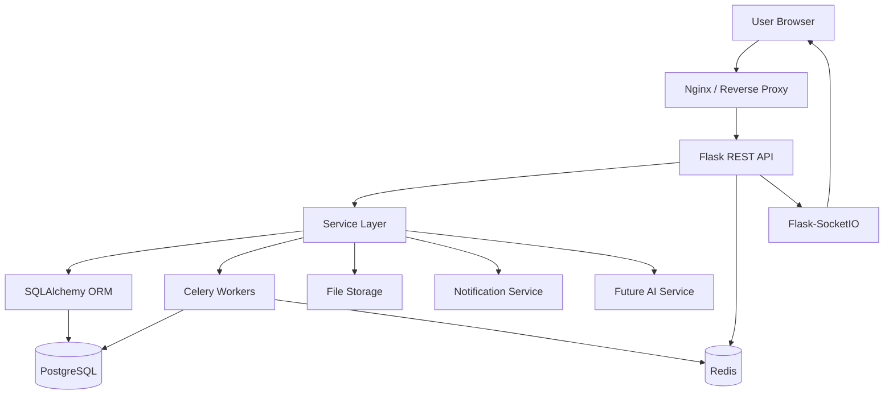

# System Architecture

## 1. High-Level Architecture

The PMS platform is designed as a modular, multi-tenant SaaS application with a clear separation between user interface, application services, data persistence, background processing, and real-time communication.

The architecture is organized around the following responsibilities:
- Presentation layer for user interaction and dashboards
- Application layer for business logic, access control, and orchestration
- Data layer for transactional persistence and analytics data
- Integration layer for notifications, file handling, and future AI services
- Infrastructure layer for containerization, reverse proxying, and future orchestration

## 2. Frontend

The frontend will be a lightweight server-rendered or static web experience built with:
- HTML
- CSS
- JavaScript
- Bootstrap 5
- Chart.js

Responsibilities:
- Authentication and onboarding screens
- Dashboard and analytics views
- Project, task, team, and calendar management views
- Real-time collaboration panels and notifications

## 3. Nginx / Reverse Proxy

Nginx will sit in front of the Flask application to provide:
- Request routing
- SSL termination in production
- Static asset delivery
- Load balancing support in later stages
- Security headers and request normalization

## 4. Flask REST API

The Flask application will expose RESTful endpoints for:
- Organization and user management
- Project and task management
- Team membership workflows
- Reporting and dashboard queries
- Notifications and calendar operations
- File-related actions

The API will use structured JSON responses and consistent validation rules.

## 5. Application / Service Layer

The core service layer will encapsulate business rules such as:
- Role-based access enforcement
- Project membership validation
- Task assignment rules
- Notification generation
- Activity logging
- Reporting calculations

This layer should remain independent from HTTP concerns so it can be reused by future APIs or background jobs.

## 6. SQLAlchemy

SQLAlchemy will be the ORM layer for persistence. It will manage:
- Entity mapping for users, organizations, projects, tasks, comments, and related models
- Transaction boundaries
- Query optimization and relationship handling
- Reusable repository-style service access patterns

## 7. PostgreSQL

PostgreSQL will be the source of truth for transactional data.

It will store:
- Users and authentication-related metadata
- Organization and membership data
- Projects, tasks, comments, attachments, and reports
- Activity logs and audit history

Design considerations:
- Strong foreign keys and constraints
- UUID-based primary keys where appropriate
- JSONB support for flexible metadata
- Indexing for tenant-scoped and query-heavy fields

## 8. Redis

Redis will support:
- Caching for frequently accessed data
- Background job queue support
- Temporary session state and rate limiting support
- Real-time feature acceleration where needed

## 9. Celery

Celery workers will process asynchronous jobs such as:
- Email and notification dispatch
- Report generation
- Bulk imports or exports
- Scheduled reminders
- Future AI pipeline tasks

## 10. Flask-SocketIO / WebSockets

Flask-SocketIO will enable real-time functionality such as:
- Live task updates
- Real-time notifications
- Collaboration indicators
- Chat and message stream updates

## 11. File Storage

File storage will be abstracted so it can support:
- Local development storage
- Object storage in later production deployment

Expected file types:
- Task attachments
- User avatars
- Project documents
- Report exports

## 12. Notification Architecture

Notifications will be generated by the service layer and dispatched through a common pipeline:
1. Event occurs in the business domain
2. Service layer creates a notification record
3. Notification is queued for delivery
4. Delivery is handled via email, in-app notification, or WebSocket push

## 13. Future AI Service

The architecture is intentionally extensible for future AI-assisted functionality such as:
- Smart task summarization
- Assistant-driven project insights
- Automated report generation
- Natural-language task creation

The AI service should be integrated as a separate service boundary to avoid coupling it tightly to the core application.

## 14. Future Kubernetes Deployment

The system is designed to be deployable in Kubernetes later with:
- Stateless Flask API pods
- Celery worker pods
- Redis as a supporting service
- PostgreSQL as a stateful data service
- Nginx ingress routing
- ConfigMaps and Secrets for environment configuration
