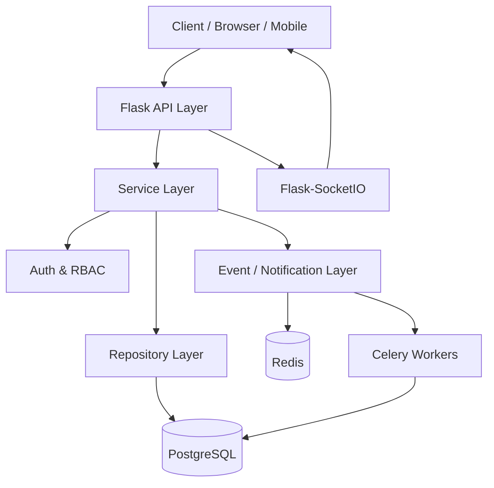
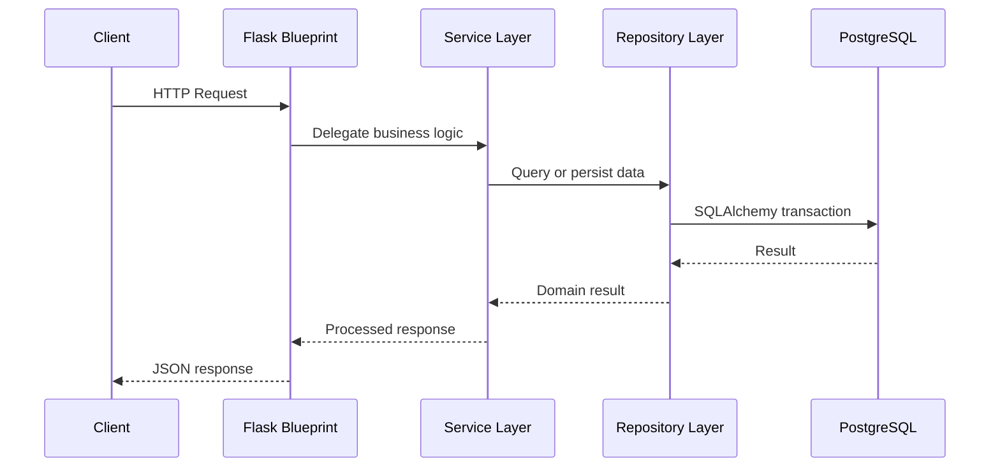
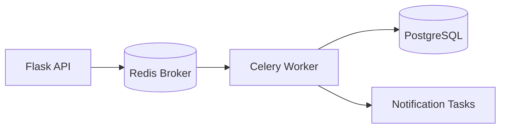

# Backend Architecture Diagram

## 1. Layered Backend Architecture

```mermaid
flowchart TD
    Client[Client / Browser / Mobile] --> API[Flask API Layer]
    API --> Services[Service Layer]
    Services --> Repositories[Repository Layer]
    Repositories --> DB[(PostgreSQL)]
    Services --> Auth[Auth & RBAC]
    Services --> Events[Event / Notification Layer]
    Events --> Redis[(Redis)]
    Events --> Celery[Celery Workers]
    Celery --> DB
    API --> WS[Flask-SocketIO]
    WS --> Client
```

## 2. Request Flow Diagram

```mermaid
sequenceDiagram
    participant Client
    participant Flask as Flask Blueprint
    participant Service as Service Layer
    participant Repo as Repository Layer
    participant DB as PostgreSQL

    Client->>Flask: HTTP Request
    Flask->>Service: Delegate business logic
    Service->>Repo: Query or persist data
    Repo->>DB: SQLAlchemy transaction
    DB-->>Repo: Result
    Repo-->>Service: Domain result
    Service-->>Flask: Processed response
    Flask-->>Client: JSON response
```

## 3. Async Processing Flow

```mermaid
flowchart LR
    API[Flask API] --> Redis[(Redis Broker)]
    Redis --> Worker[Celery Worker]
    Worker --> DB[(PostgreSQL)]
    Worker --> Notifications[Notification Tasks]
```
