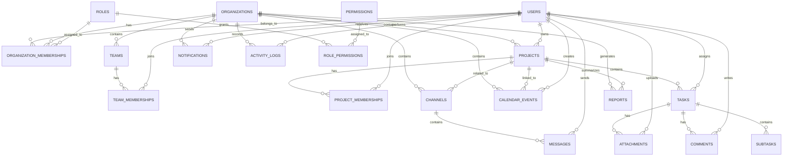

# ERD Reference

The database ERD remains aligned with the schema design and the earlier requirement-driven model.

```mermaid
erDiagram
    USERS ||--o{ ORGANIZATION_MEMBERSHIPS : belongs_to
    ORGANIZATIONS ||--o{ ORGANIZATION_MEMBERSHIPS : has
    ROLES ||--o{ ORGANIZATION_MEMBERSHIPS : assigned_to
    ORGANIZATIONS ||--o{ TEAMS : contains
    TEAMS ||--o{ TEAM_MEMBERSHIPS : has
    USERS ||--o{ TEAM_MEMBERSHIPS : joins
    ORGANIZATIONS ||--o{ PROJECTS : contains
    USERS ||--o{ PROJECTS : owns
    PROJECTS ||--o{ PROJECT_MEMBERSHIPS : has
    USERS ||--o{ PROJECT_MEMBERSHIPS : joins
    PROJECTS ||--o{ TASKS : contains
    USERS ||--o{ TASKS : assigns
    TASKS ||--o{ SUBTASKS : contains
    TASKS ||--o{ COMMENTS : has
    USERS ||--o{ COMMENTS : writes
    TASKS ||--o{ ATTACHMENTS : has
    USERS ||--o{ ATTACHMENTS : uploads
    ORGANIZATIONS ||--o{ NOTIFICATIONS : sends
    USERS ||--o{ NOTIFICATIONS : receives
    ORGANIZATIONS ||--o{ CALENDAR_EVENTS : contains
    PROJECTS ||--o{ CALENDAR_EVENTS : linked_to
    USERS ||--o{ CALENDAR_EVENTS : creates
    ORGANIZATIONS ||--o{ CHANNELS : contains
    PROJECTS ||--o{ CHANNELS : related_to
    CHANNELS ||--o{ MESSAGES : contains
    USERS ||--o{ MESSAGES : sends
    ORGANIZATIONS ||--o{ ACTIVITY_LOGS : records
    USERS ||--o{ ACTIVITY_LOGS : performs
    ORGANIZATIONS ||--o{ REPORTS : generates
    PROJECTS ||--o{ REPORTS : summarizes
    ROLES ||--o{ ROLE_PERMISSIONS : grants
    PERMISSIONS ||--o{ ROLE_PERMISSIONS : assigned_to
```
