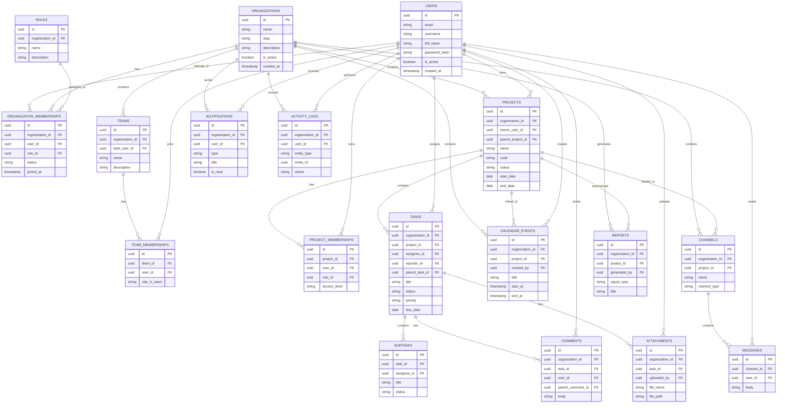

# ERD — PMS

```mermaid
erDiagram
    USERS ||--o{ ORGANIZATION_MEMBERSHIPS : belongs_to
    ORGANIZATIONS ||--o{ ORGANIZATION_MEMBERSHIPS : has
    ROLES ||--o{ ORGANIZATION_MEMBERSHIPS : assigned_to
    ORGANIZATIONS ||--o{ TEAMS : contains
    TEAMS ||--o{ TEAM_MEMBERSHIPS : has
    USERS ||--o{ TEAM_MEMBERSHIPS : joins
    ORGANIZATIONS ||--o{ PROJECTS : contains
    USERS ||--o{ PROJECTS : owns
    PROJECTS ||--o{ PROJECT_MEMBERSHIPS : has
    USERS ||--o{ PROJECT_MEMBERSHIPS : joins
    PROJECTS ||--o{ TASKS : contains
    USERS ||--o{ TASKS : assigns
    TASKS ||--o{ SUBTASKS : contains
    TASKS ||--o{ COMMENTS : has
    USERS ||--o{ COMMENTS : writes
    TASKS ||--o{ ATTACHMENTS : has
    USERS ||--o{ ATTACHMENTS : uploads
    ORGANIZATIONS ||--o{ NOTIFICATIONS : sends
    USERS ||--o{ NOTIFICATIONS : receives
    ORGANIZATIONS ||--o{ CALENDAR_EVENTS : contains
    PROJECTS ||--o{ CALENDAR_EVENTS : linked_to
    USERS ||--o{ CALENDAR_EVENTS : creates
    ORGANIZATIONS ||--o{ CHANNELS : contains
    PROJECTS ||--o{ CHANNELS : related_to
    CHANNELS ||--o{ MESSAGES : contains
    USERS ||--o{ MESSAGES : sends
    ORGANIZATIONS ||--o{ ACTIVITY_LOGS : records
    USERS ||--o{ ACTIVITY_LOGS : performs
    ORGANIZATIONS ||--o{ REPORTS : generates
    PROJECTS ||--o{ REPORTS : summarizes

    USERS {
        uuid id PK
        string email
        string username
        string full_name
        string password_hash
        boolean is_active
        timestamp created_at
    }

    ORGANIZATIONS {
        uuid id PK
        string name
        string slug
        string description
        boolean is_active
        timestamp created_at
    }

    ORGANIZATION_MEMBERSHIPS {
        uuid id PK
        uuid organization_id FK
        uuid user_id FK
        uuid role_id FK
        string status
        timestamp joined_at
    }

    ROLES {
        uuid id PK
        uuid organization_id FK
        string name
        string description
    }

    TEAMS {
        uuid id PK
        uuid organization_id FK
        uuid lead_user_id FK
        string name
        string description
    }

    TEAM_MEMBERSHIPS {
        uuid id PK
        uuid team_id FK
        uuid user_id FK
        string role_in_team
    }

    PROJECTS {
        uuid id PK
        uuid organization_id FK
        uuid owner_user_id FK
        uuid parent_project_id FK
        string name
        string code
        string status
        date start_date
        date end_date
    }

    PROJECT_MEMBERSHIPS {
        uuid id PK
        uuid project_id FK
        uuid user_id FK
        uuid role_id FK
        string access_level
    }

    TASKS {
        uuid id PK
        uuid organization_id FK
        uuid project_id FK
        uuid assignee_id FK
        uuid reporter_id FK
        uuid parent_task_id FK
        string title
        string status
        string priority
        date due_date
    }

    SUBTASKS {
        uuid id PK
        uuid task_id FK
        uuid assignee_id FK
        string title
        string status
    }

    COMMENTS {
        uuid id PK
        uuid organization_id FK
        uuid task_id FK
        uuid user_id FK
        uuid parent_comment_id FK
        string body
    }

    ATTACHMENTS {
        uuid id PK
        uuid organization_id FK
        uuid task_id FK
        uuid uploaded_by FK
        string file_name
        string file_path
    }

    NOTIFICATIONS {
        uuid id PK
        uuid organization_id FK
        uuid user_id FK
        string type
        string title
        boolean is_read
    }

    CALENDAR_EVENTS {
        uuid id PK
        uuid organization_id FK
        uuid project_id FK
        uuid created_by FK
        string title
        timestamp start_at
        timestamp end_at
    }

    CHANNELS {
        uuid id PK
        uuid organization_id FK
        uuid project_id FK
        string name
        string channel_type
    }

    MESSAGES {
        uuid id PK
        uuid channel_id FK
        uuid user_id FK
        string body
    }

    ACTIVITY_LOGS {
        uuid id PK
        uuid organization_id FK
        uuid user_id FK
        string entity_type
        uuid entity_id
        string action
    }

    REPORTS {
        uuid id PK
        uuid organization_id FK
        uuid project_id FK
        uuid generated_by FK
        string report_type
        string title
    }
```
