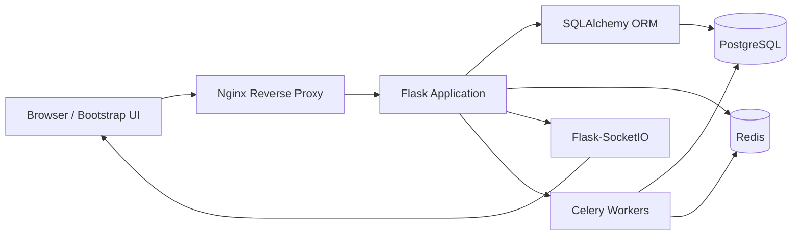

# System Architecture Overview

## Architectural Notes
- The Flask application will expose REST endpoints for core project management workflows.
- WebSocket channels will support real-time notifications, chat updates, and collaborative task events.
- Celery workers will handle report generation, email notifications, and asynchronous processing.
- PostgreSQL remains the source of truth for transactional state.
- Redis supports caching, session handling, and task queue management.
